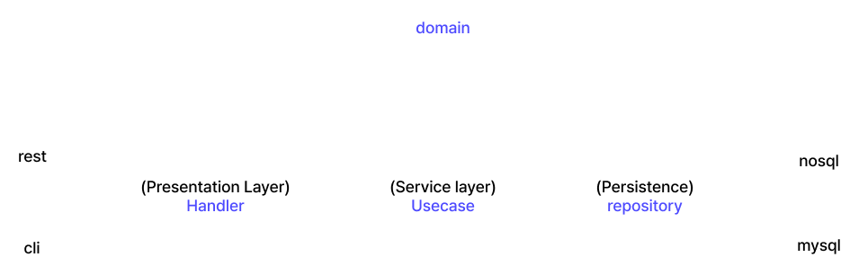

# simple-clean-architecture
Clean Architecture with the go Language 

### Schematicization:



### File Struct: 
```
├── cmd
│   └── app
│       └── main.go
├── go.mod
├── go.sum
└── internal
    ├── domain
    │   ├── domain_errors.go
    │   └── domain_user.go
    ├── handler
    │   ├── handler_user.go
    │   └── test.go
    ├── infra
    │   ├── config
    │   │   └── config.go
    │   ├── middleware
    │   │   └── keep.md
    │   ├── presenter
    │   │   └── v1
    │   │       ├── v1_user_request.go
    │   │       └── v1_user_response.go
    │   ├── sniff
    │   │   └── sniff.md
    │   └── verfier
    │       └── validator.go
    ├── repository
    │   ├── database
    │   │   └── database.go
    │   ├── ent 
    │   │   ├── ... 
    │   ├── repository_user.go
    │   └── utils
    │       └── convert.go
    └── usecase
        └── usecase_user.go
```
